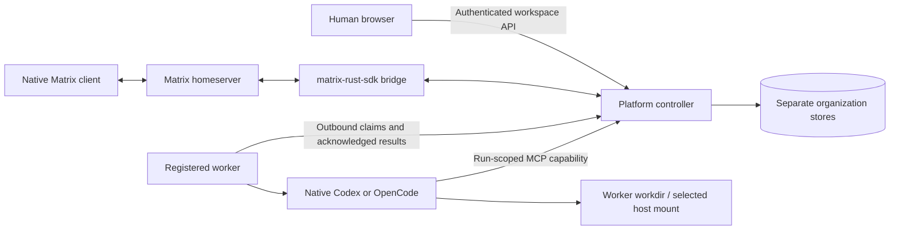

# Decentralized platform verification — 21 September 2026

The previous local development was merged and pushed to GitHub `main` as
`7e54de0dbc107a822790314388b42427050122d1` before this feature branch started.
The feature implementation is on `codex/decentralized-workspaces`.

## Implemented behavior

| Request | Delivered path |
| --- | --- |
| Multiplatform setup | Source installers for Windows, Debian/Ubuntu and macOS; Docker controller/worker images and Compose; native startup service scripts |
| Persistent registered workers | One-use enrollment, workspace-bound tokens, outbound polling, durable claims and result acknowledgments, cancellation, saved native sessions |
| Runtime workdir | Worker-local canonical root validation; named Docker volume or selected host bind mount |
| Workspaces and organizations | Create, list, rename, soft-delete and restore; separate organization SQLite stores; authenticated owners and members |
| Sharing groups | Explicit human and agent membership; manager/team selection with excluded branches; reporting ancestors included; project structure remains customizable |
| Human/agent chat | Ordinary messages do not start agents; explicit complete mentions and the working @ picker select participants |
| Matrix | Actual matrix-rust-sdk login, private rooms, membership reconciliation, event ingestion and idempotent outgoing messages |
| Authentication | Matrix password login, expiring hashed opaque sessions, HttpOnly/SameSite cookies, logout revocation, tenant/group checks, separate worker and run capabilities |

The control plane remains a single Rust process. Execution is distributed to registered
workers. Original bootstrap-owner local/SSH behavior remains available for migration;
new workspaces require registered workers. No parallel scheduler was introduced.

## Evidence

- `cargo test --locked --bin agentic-enterprise --no-fail-fast`: **62 passed**, zero failed/ignored.
- `cargo build --locked`: native Windows binary built.
- `npm run lint`: passed without warnings on the final frontend.
- `npm run build`: passed; existing large-chunk advisory remains.
- `git diff --check`: passed.
- PowerShell AST parse and macOS `bash -n`: installer syntax passed.
- Docker Linux ARM64 platform and worker images built on `mac-personal` using Rust 1.94 and Node 22.
- Real Synapse v1.161.0, SQLite and native Codex 0.155.1 were used. No API, authentication, database, worker or model mocks.

### Windows native end-to-end

`verify-decentralized.py` exercised actual HTTP and Matrix APIs and a registered Windows worker:

- Unauthenticated and invalid-login requests: **401**.
- Workspace CRUD and independent organization initialization: passed.
- Cross-tenant access: **403**; controller catalog access from another workspace: **400**.
- Allowed human room access: **200**; excluded human access: **403**.
- Selecting one child included its parent and excluded the sibling; excluded agent dispatch: **400**.
- Ordinary human room post: **zero new runs**.
- Enrollment reuse, runtime-token access to human APIs, revoked runtime token: **401**.
- Logout invalidated the saved browser session.
- Worker paths outside its registered root: **400**.
- Native Matrix text imported once, and the platform human post reached Matrix.
- A human Matrix client could not bypass group access by inviting an excluded user: **403**.
- Controller-native catalog/credential access was denied from another workspace; the registered-worker connection probe passed.
- Real worker run `18c98506-f4cf-4d9a-8a0a-f6c08638d3b7` returned `DECENTRALIZED_SMOKE_OK`.
- Native session: `01a0c4b0-b5d9-7a60-8ff0-95419456458c`; worker process PID **18072**.

`verify-workspace-ui.mjs` used a real Edge browser: login, @ picker inserting `@ceo`,
workspace creation and navigation all passed, with **zero page errors**. The same browser
check against the Mac Docker deployment also selected a team while excluding its sibling,
then registered and revoked a runtime through the actual UI. Screenshots
were inspected in the ignored verification directory.

### mac-personal Docker deployment

Isolated Compose project: `ae-decentralized-test`.
Directory: `/Users/punya-tirta/ae-decentralized-test`.
Platform: `http://localhost:18766`; Matrix: `http://localhost:18767` on the Mac.
Persistent controller, Matrix and worker volumes are retained. The worker mounts only
the dedicated test workdir and a dedicated native credential directory.

- The real HTTP/Matrix/worker suite passed on Linux ARM64 inside Docker.
- Runtime registration: `4f70cb79-c03b-4544-8dce-b4336aec87a2`.
- Worker run `fd64c31f-3f63-4a5c-90eb-314848bccb75`: `DECENTRALIZED_SMOKE_OK`.
- Worker and controller restart caused **no command replay**.
- Subsequent run `cc9d0406-08a6-479d-a1bd-773be47fc447` resumed native session
  `01a0c4b2-3d6b-76c1-ac17-2931c3e32f05` and wrote `HOST_MOUNT_OK` to the actual Mac file
  `/Users/punya-tirta/ae-decentralized-test/workdir/bind-proof-56f42e3fb22a4292b60f2d3a32eedf6c.txt`.
- Cancellation run `bd477084-88c7-4dd0-8988-80f9571bcb67`: **cancelled**; the owned `sleep 90`
  process was absent from `docker compose top worker`, and its completion file was absent.
- Codex workspace-write remained enabled. Docker's default seccomp policy initially blocked
  bubblewrap; a pinned Moby profile with the required unprivileged namespace/mount syscalls
  fixed real tool execution without privileged mode or a full-access permission override.

A final repeat exposed a heartbeat/exit race: a closed stdin pipe could override a valid
completion receipt. The shared harness now reconciles the receipt after draining output,
while preserving explicit cancellation and timeout status. The final Docker smoke,
restart/resume, host-write and cancellation suites all passed after this correction.

### Standalone Docker runtime

A second Compose project, `ae-decentralized-runtime`, was started using
`compose.worker.yaml`. It contains only a worker, connects to the existing platform,
and uses a separate host workdir. Its runtime `729f4531-0dc7-45b6-8c17-039f2343cb81` completed run
`38ad9fc2-8169-45be-899e-aea414ff70d8` with `STANDALONE_WORKER_OK` and wrote the actual host file
`/Users/punya-tirta/ae-decentralized-test/standalone-workdir/standalone-proof.txt`. No second controller or Matrix server was started.
Both Docker workers remain registered and running for inspection.

## Reproduce

See `scripts/verify-decentralized.py --help`, `scripts/verify-worker-recovery.py --help`
and `scripts/verify-workspace-ui.mjs` for the runnable real-service checks. Their credentials
come from private fixture files, not committed source. See [DEPLOYMENT.md](DEPLOYMENT.md)
for installation and registration instructions.

The repository is private. The documented one-liners retrieve scripts through an
authenticated GitHub CLI session; unauthenticated raw URLs return 404. Authenticated
script retrieval and Git access through the per-command GitHub credential helper
were verified without changing global Git credentials. Bash syntax and PowerShell
AST parsing passed; this does not replace clean-machine installation testing.

## Sign-in UI correction

The first login implementation used bare controls under Tailwind's reset and put
the `login-card` class on the form, although the existing CSS expected a nested
form. The result was invisible field boundaries and collapsed label spacing.
The corrected entry screen uses the existing Input/Button components, explicit
labels, a separate administrator sign-in option, password visibility, submission
feedback and actionable credential errors. No authentication rules were relaxed.

`node src/scripts/verify-login-ui.mjs http://localhost:18766 <private-owner-key-file> <output-directory>`
passed against the rebuilt Mac Docker platform: widths 320, 375, 705 and 1440;
bordered fields and 44px controls; no horizontal overflow; incorrect credentials;
password visibility; cleared secrets when changing sign-in method; real owner
login and logout; zero page errors. Desktop and mobile screenshots were visually
inspected. `npm run lint`, `npm run build` and `git diff --check` passed.
The existing workspace UI check now uses the administrator sign-in button.

## Workspace and runtime UI follow-up

Workspace management now uses a responsive dialog instead of unstyled forms above
the application. The workspace switcher, people list, invitations and destructive
actions use the shared design components. Runtime settings have a dedicated page,
empty and loading states, machine status rows, enrollment steps, clipboard feedback
and a confirmation before revocation. Controller SSH settings are a separate tab.
Group invitation checkboxes use consistent spacing and visible controls.

Member settings explain access without mounting owner-only runtime requests.
Members see their rooms without owner-only create, reorder, search and configuration
controls. The backend authorization rules are unchanged. Member connection status
follows successful requests instead of displaying a false reconnect notice at login.

The real `verify-workspace-ui.mjs` workflow against the Mac Docker deployment covers
owner login, workspace creation, mention insertion, selective team membership,
runtime registration and confirmed revocation. With a private users fixture as its
fourth argument, it also signs in as a member and verifies that runtime registration
and invitations are not offered and no permission alert is shown. Owner/member
screens are checked at 1440, 705 and 375 pixels with no horizontal page overflow.
Screenshots are stored under the ignored verification directory and visually reviewed.

## Message ownership correction (2026-09-22)

Own-message alignment now compares the sender with the authenticated user instead
of the literal bootstrap `owner` identity. Own messages are blue, right-aligned and
labeled "You"; other humans and agents stay left-aligned. Reply previews use the
same viewer identity and retain names for other humans.

`verify-message-identity.mjs` passed against existing Mac deployment history in
separate Alice and owner sessions. It checked platform and Matrix-originated human
messages, agent replies, both reply-preview labels, and computed blue bubble color
`rgb(20, 86, 199)`. Both sessions reported zero page errors. No messages were sent
or history changed by this verification. The Alice screenshot was visually reviewed.
Frontend lint/build and the Mac Docker build passed.

## Practical limits

- Native clean-machine installation was not run on all three OS families. Windows native
  execution and Linux ARM64 Docker execution on the Mac were exercised. Installers require
  the documented build prerequisites; there are no signed binary releases yet.
- Matrix bridges main-room text. Side chats and attachments remain platform-local. Rooms
  are not end-to-end encrypted, and the trusted bridge labels messages rather than
  impersonating each human/agent as a separate Matrix account.
- Identity uses Matrix password login; SSO/OIDC and password-reset UI are not implemented.
  Workspace members have scoped room access; administration remains owner-only.
- This is one controller with SQLite organization stores, not a highly available controller cluster.
- Managed service/container restart preserves registration and native sessions. It interrupts
  active work; it does not migrate or automatically replay commands. Unmanaged Unix SIGKILL
  cannot guarantee cleanup of descendants.
- Provider and model catalog availability still comes from each worker's installed, signed-in
  native CLI. The new registered-worker end-to-end tests used Codex; OpenCode uses the same
  transport adapter but was not live-tested through this transport.
- Worker outboxes and controller run evidence currently require operator retention management
  for long-running deployments.
